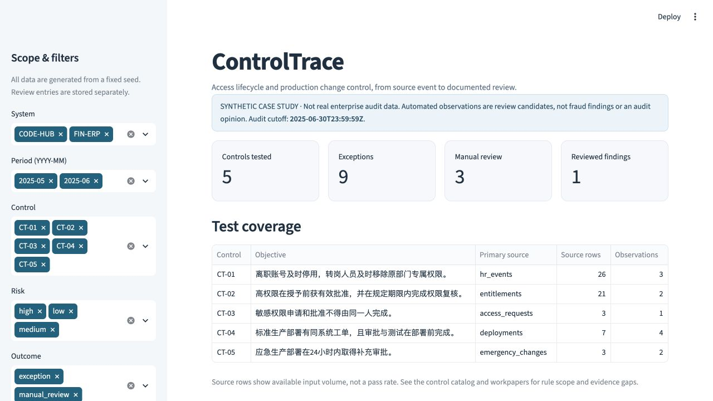

# ControlTrace｜IT 审计证据与内控测试平台

**业务问题。** 在访问权限和生产变更审计中，HR、IAM、工单、代码和部署日志常分散在不同系统。ControlTrace 把这些记录按稳定 ID 串起来，逐条说明控制目标、命中依据和原始证据，再让审计人员记录复核意见并导出可复现的底稿。

> **合成案例，非真实企业审计。** 人员、账号、系统和变更记录完全虚构。规则命中是待复核线索，不能直接认定舞弊、控制失效或出具审计意见。

**架构速览：** 固定种子合成 HR、IAM、工单、代码与部署记录 → DuckDB 快照 → 五项规则测试 → 人工复核历史 → CSV 与可校验底稿 ZIP。[数据字典](docs/DATA_DICTIONARY.md)列出表和关联键；[控制目录](docs/CONTROL_CATALOG.md)列出输入、阈值、例外与局限。五项控制分别覆盖：①离职/转岗权限，②高权限审批/周期复核，③敏感权限职责分离，④生产变更工单/事前审批/测试，⑤应急补批。

```bash
uv run controltrace demo
```

从项目根目录运行这一条命令，即生成固定种子的演示数据、执行控制测试并启动本机 Streamlit 界面。首次运行需安装 [uv](https://docs.astral.sh/uv/) 并可联网安装依赖；默认页面为 `http://127.0.0.1:8501`。数据保存在本地 `data/controltrace.duckdb`，不会连接企业系统。



截图包含一次示范复核；新生成的数据库从未复核状态开始。选中异常后的[证据详情截图](assets/controltrace-finding.png)展示关联记录 ID、规则依据和事件时间线。

## 从数据到工作底稿

```text
合成 HR / IAM / 变更 / 部署记录
        ↓ 稳定 ID、来源、事件时间、审计截止日
DuckDB 数据快照
        ↓ 五类自动控制测试
异常线索（规则依据 + 证据 ID + 时间线 + 关联记录）
        ↓ 人工复核（复核人、时间、状态、结论、备注）
异常清单 CSV + 审计底稿 ZIP
```

平台仅针对**系统访问权限与生产变更控制**。与侧重财务凭证异常分析的 [AuditLens](https://github.com/dev-belly/AuditLens) 相比，这里更关心权限生命周期、职责分离、部署前置证据和应急补批。

### GitHub 同类项目的借鉴与取舍

开发前检查了四个开源项目，只借鉴设计思路，没有复制源码。

| 项目 | 借鉴的做法 | 在本项目中的取舍 |
| --- | --- | --- |
| [AuditFlow](https://github.com/Kirk-KV/AuditFlow)（MIT） | 底稿 ID 与证据链校验 | 每条发现保留稳定 ID、源证据 ID，并在底稿包清单中保存数据哈希；控制结论仍需人工复核。 |
| [vcs-access-review](https://github.com/mattschaller/vcs-access-review)（MIT） | 将采集、规则与呈现分层 | 对缺失审批或测试证据单独标识，避免把采集失败默默跳过；不以公开事件直接代理企业内部访问事实。 |
| [Probo](https://github.com/getprobo/probo)（MIT） | 稳定访问记录与决策历史 | 保留授权 ID 和逐次复核记录；维持轻量的审计演示范围。 |
| [AccessFlow](https://github.com/bablsoft/accessflow)（Apache-2.0） | 审批轨迹和独立复核 | 核验申请、批准与授予时序；ControlTrace 做事后证据测试，不把界面复核当作事前授权关卡。 |

## 五项控制及判断口径

本合成案例的审计截止时点是 **2025-06-30 23:59:59 UTC**。阈值是演示政策，不代表统一法规要求。各规则的字段、例外和局限详见[控制测试目录](docs/CONTROL_CATALOG.md)。

| 控制 | 自动测试的核心判断 | 需留给人工复核的部分 |
| --- | --- | --- |
| CT-01 员工生命周期 | 离职后 48 小时未记录账号停用；转岗后 5 天未记录旧权限撤销 | 关联不到账号、延续访问授权、岗位职责与源系统状态 |
| CT-02 高权限授权与复核 | 高权限缺有效事前审批；到期未完成权限复核 | 授权关联缺失、批准人权限、审批范围与外部证据 |
| CT-03 职责分离 | 同一稳定员工 ID 申请并批准敏感权限 | 角色敏感性映射缺失、代理授权及真实审批链 |
| CT-04 生产变更 | 部署缺同系统工单；审批、测试或关联提交晚于部署 | 部署类型未知、提交缺失或工单不一致、回滚及测试质量 |
| CT-05 应急变更 | 同部署同工单的补批未在部署后 24 小时内完成 | 应急记录缺失、工单不一致、值班批准路径和政策例外 |

## 使用流程

```bash
uv run controltrace generate   # 幂等生成合成数据；不覆盖已有复核记录
uv run controltrace test       # 执行规则并保存发现
uv run controltrace export     # 重新测试并导出 CSV、可核验底稿 ZIP；新环境可直接运行
uv run controltrace verify     # 校验 ZIP 文件哈希，并从包内源数据重放自动测试
```

界面可以按系统、期间、控制类型和风险等级筛选线索；点开一条线索可查看事件时间线、关联记录、规则依据和证据 ID。复核者填写姓名、处理状态、结论与备注后，导出的 CSV 和 ZIP 会包含当前复核记录。ZIP 同时包含合成源表的原值 JSON、适合表格查看的 CSV、机器可读的复核历史 `reviews.json`、规则元数据、全部文件的 SHA-256 清单和逐条 Markdown 底稿。`verify` 会核对文件哈希、CSV 与 JSON 的一致性，并用包内原值重放规则，逐字节比较所选发现清单与底稿。旧格式底稿须用当前版本重新导出。

## 数据字典与案例

- [数据字典](docs/DATA_DICTIONARY.md)：各源表、主键、关联键、时间和来源字段。
- [控制测试目录](docs/CONTROL_CATALOG.md)：控制目标、输入、逻辑、例外和局限。
- [完整复核案例](docs/CASE_STUDY.md)：从一条异常到证据、人工复核与导出底稿。
- [实际导出的案例底稿](docs/EXAMPLE_WORKPAPER.md)：含来源记录、规则依据与示范复核历史。

`expected_results` 是演示数据的答案清单，仅用于测试和展示规则边界，不应当作审计人员的独立判断，也不应以合成命中数宣称真实环境下的识别率。

## 工程与验证

Python 3.11+；DuckDB 存储关联数据；规则、数据生成、复核、导出和 Streamlit 界面分离。`pyproject.toml` 定义依赖及命令入口，CI 在 Python 3.11 和 3.12 上运行 Ruff 与 pytest。

```bash
python -m pip install -e ".[dev]"
python -m ruff check src tests
python -m pytest -q
```

**本机验证（2026-09-28）：** `uv run ruff check .`、项目构建和 `uv run pytest -q` 均通过，**41 passed**；测试覆盖日期边界、重复源事件、非默认种子、缺失关联、关键时间缺失、复核状态、界面筛选、导出校验及重放，还会拒绝包内哈希已更新但内容互相矛盾的底稿。一条命令启动 Streamlit 后，实际检查了异常行选择、D002 的时间线、复核保存以及 CSV/ZIP 导出。合成数据产生 12 条预置线索（9 条按演示口径命中，3 条待人工判断），并与 `expected_results` 完全对应。[GitHub Actions CI](https://github.com/dev-belly/ControlTrace/actions/workflows/ci.yml) 在 Python 3.11 和 3.12 上运行相同的检查。

## 已知局限

- 合成案例按预设规则构造，不能据此推断真实企业中的识别率或审计有效性。
- 源系统抽取若遗漏账号、审批或部署日志，自动测试可能误报或漏报。已知的断链会列为人工核实，但整个源表或事件完全未被抽取时，规则无法察觉；记录间能关联也不证明原始记录真实完整。
- 时间阈值、角色敏感性与应急流程均由本案例假设定义；用于实际审计前必须与受审单位政策、时区和完整性测试核对。
- 审批存在不证明授权合理，测试完成不证明质量充分，日志中账号停用不证明目标系统实时拒绝登录。
- 审计人员的复核结论与原始自动命中应分开保存；底稿提供复现路径，不构成审计报告或监管认证。
- ZIP 中的哈希只能发现与包内清单不一致的改动，未使用数字签名，不能证明外部来源的真实性。当前演示也没有连接或认证任何企业系统。
