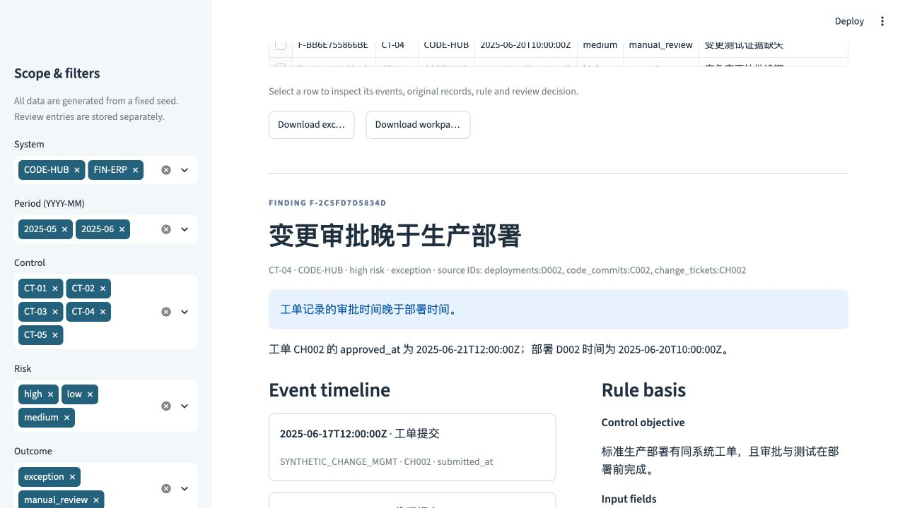

# 完整案例：D002 部署的审批晚于上线

> 合成案例，非真实企业审计。本文记录一次真实运行 ControlTrace 演示程序并在界面保存示范复核的过程。`confirmed_exception` 仅指本合成数据符合演示控制的时间违例口径，不是对任何真实组织的审计结论。



## 1. 控制目标与总体

CT-04 要求标准生产部署有同系统变更工单，且审批、测试完成时间均不晚于部署时间。演示审计截止时点为 `2025-06-30T23:59:59Z`。D002 的 `deployment_type=STANDARD`，因此适用事前控制；应急部署另由 CT-05 测试。

## 2. 获取并串联原始证据

| 合成来源记录 | 关键字段 | 用途 |
| --- | --- | --- |
| `deployments:D002`，来源 `SYNTHETIC_CICD` | `system_id=CODE-HUB`；`ticket_id=CH002`；`commit_id=C002`；`deployed_at=2025-06-20T10:00:00Z` | 确定部署、系统和控制测试时点。 |
| `code_commits:C002`，来源 `SYNTHETIC_GIT` | `ticket_id=CH002`；`committed_at=2025-06-20T08:00:00Z` | 验证代码提交与同一工单的关联；不代表代码已经充分审查。 |
| `change_tickets:CH002`，来源 `SYNTHETIC_CHANGE_MGMT` | `system_id=CODE-HUB`；`submitted_at=2025-06-17T12:00:00Z`；`approved_at=2025-06-21T12:00:00Z`；`tested_at=2025-06-22T12:00:00Z` | 与部署比较审批和测试完成顺序。 |

三个 ID 在合成源表中稳定关联，原行连同 `source_system` 和 `audit_cutoff` 一起保存在底稿包。界面显示如下时间线：

```text
2025-06-17 12:00 UTC  CH002 工单提交
2025-06-20 08:00 UTC  C002 代码提交
2025-06-20 10:00 UTC  D002 生产部署
2025-06-21 12:00 UTC  CH002 审批记录
2025-06-22 12:00 UTC  CH002 测试记录
```

## 3. 自动判断与边界

部署时间比审批记录早 **26 小时**，因此规则产生 `F-2C5FD7D5834D`，原因代码 `deployment_approval_late`，风险排序为 `high`，自动分类为 `exception`。同一部署的测试记录比部署晚 **50 小时**，另产生 `F-28B1B13197B7`，原因代码 `deployment_test_late`；这两条独立命中不能被误算为两次部署。

如果 `approved_at` 或 `tested_at` 没有抽取到，CT-04 会给出 `manual_review` 资料缺口；这不同于记录明确显示发生在部署之后。时间顺序只说明导出数据中的先后，不证明审批人的权限、测试质量或实际部署范围。

## 4. 人工复核与处理状态

在实际运行的 Streamlit 界面选中 `F-2C5FD7D5834D` 后，示范复核人 `Demo Reviewer` 打开关联的 D002、C002、CH002 行，核对工单和部署时间。界面保存了一条追加式复核记录：

| 字段 | 本次示范复核 |
| --- | --- |
| 复核时间 | `2026-09-27T12:14:55.173393Z` |
| 处理状态 | `closed` |
| 复核结论 | `confirmed_exception` |
| 备注 | “Synthetic ticket CH002 records approval at 2025-06-21 12:00 UTC, after deployment D002 at 2025-06-20 10:00 UTC. Confirmed timing exception for this demo; test quality and real authorization remain outside scope.” |

此复核只确认**合成抽取中的时间违例**。如果这是实际项目，还需向工单负责人获取审批原件、流水线时钟和例外授权，再由有资格的审计人员定性。重新运行控制测试不会抹掉已经保存的复核历史。

## 5. 导出与复现

本次实际导出的[单条 Markdown 底稿](EXAMPLE_WORKPAPER.md)保留了规则目标、输入字段、判断逻辑、限制、完整来源行、时间线及示范复核记录。程序导出的 `workpapers.zip` 还包含全部合成源表的原值 JSON 和便于表格查看的 CSV、`rules.json`、`findings.csv` 和 `manifest.json`；清单记录每个文件的 SHA-256 以及总数据指纹。

```bash
uv run controltrace demo
# 在页面选择该发现并记录自己的复核后，或在另一终端执行：
uv run controltrace export
uv run controltrace verify --bundle exports/workpapers.zip
```

在新安装环境中，固定种子会复现同一条自动发现及其来源 ID；**人工复核不会预置**，应由使用者在界面自行记录。`verify` 会校验包内文件并以 JSON 原值重放当前规则；也可将导出的 `source_tables/deployments.json`、`code_commits.json` 和 `change_tickets.json` 对应 ID 与底稿逐字段核对，再比较 `approved_at`、`tested_at`、`committed_at` 和 `deployed_at`。重放须使用与底稿一致的规则版本；`expected_results` 只是合成案例的测试答案，不参与规则计算。
